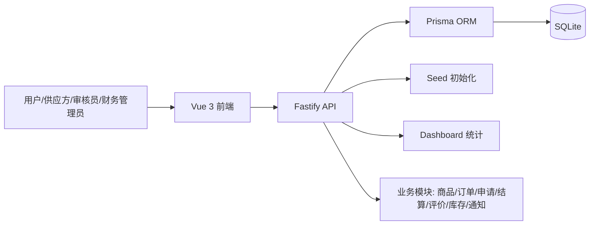
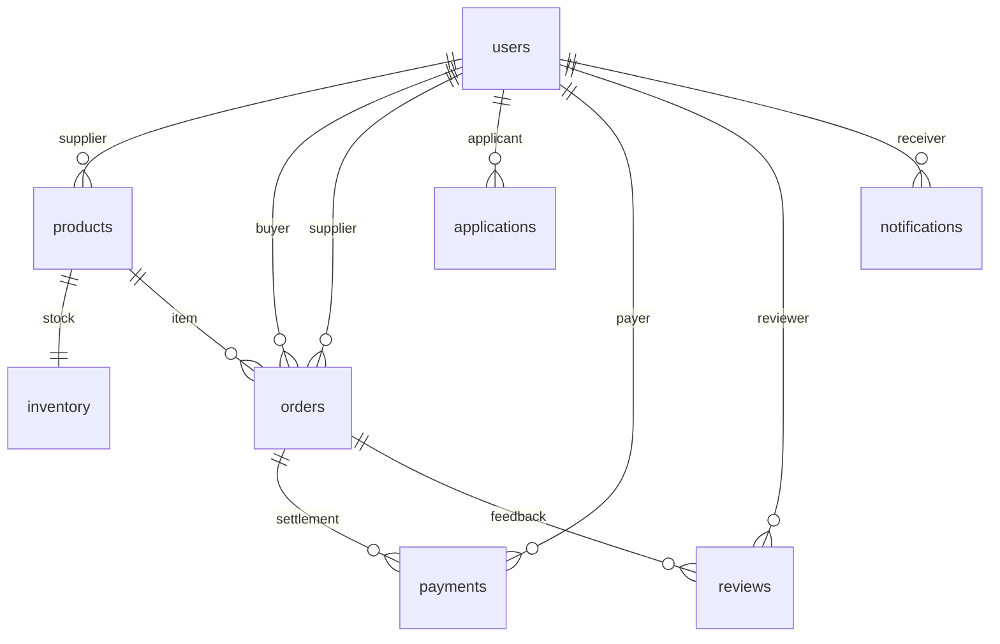

# 交易与供需协同平台

## 🛠 技术栈
- Frontend: Vue 3 + Vite + Element Plus + Pinia
- Backend: Node.js + Fastify + Prisma
- Database: SQLite

## 🚀 启动指南 (How to Run)
1. 确保 Docker 已启动。
2. 在 `environment/` 目录执行：`docker build -t trade-supply-platform -f Dockerfile .`
3. 启动容器：`docker run --rm -p 8080:8080 trade-supply-platform`
4. 首次启动会自动生成 SQLite 数据库、写入演示数据，并同时提供前端页面和后端接口。

## 🔗 服务地址 (Services)
- App: http://localhost:8080
- Backend Swagger: http://localhost:8080/docs

## 🧪 测试账号
- Admin: admin / 123456
- Supplier: supplier / 123456
- Auditor: auditor / 123456
- Finance: finance / 123456
- User: user / 123456

## 📌 项目摘要
面向采购、供应、审核与财务协作场景，平台把商品/资源、订单、申请、结算、评价、库存和通知收拢到同一业务闭环中，支持真实的新增、查询、筛选、编辑、删除与统计联动。

## 🏗️ 系统架构


## 💾 数据设计


## 🔄 核心业务流程
1. 用户提交需求 -> 审核或报价 -> 完成交易/结算
2. 供应方维护商品或资源 -> 接收订单 -> 更新状态
3. 管理员查看流水和评价 -> 调整运营策略

## 📁 目录结构
```text
.
├── backend/            # Fastify 后端、Prisma schema 和 seed
├── frontend/           # Vue 3 前端、Element Plus 页面与路由
└── README.md
```

## 🔧 主要接口
- `POST /api/auth/login`
- `POST /api/auth/register`
- `GET /api/auth/me`
- `GET /api/products`
- `GET /api/orders`
- `GET /api/applications`
- `GET /api/payments`
- `GET /api/reviews`
- `GET /api/inventory`
- `GET /api/notifications`
- `GET /api/stats/dashboard`

## 🧩 初始化方式
- 容器启动时会自动执行 `prisma db push`
- 同时执行 `prisma/seed.js` 初始化演示数据
- 若 `admin` 已存在，系统会自动修正为启用状态并重置为 `123456`

## 🧪 生产级特性
- 统一响应体：`{ code, message, data }`
- 前端统一错误提示与 2 秒消息去重
- 后端参数校验与友好中文错误
- ORM 持久化与级联删除前关联检查
- Docker Volume 数据持久化
- 角色权限控制与路由守卫
- 中文 UTF-8 / utf8mb4 全链路支持
